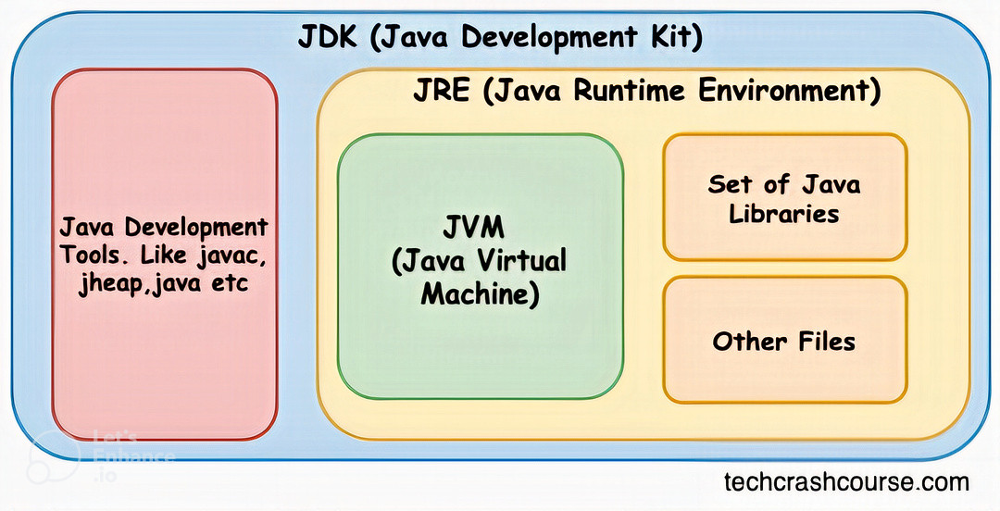
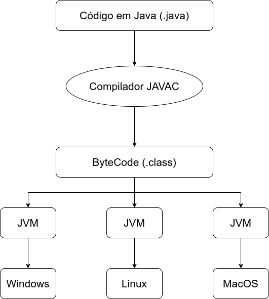

# Atalhos 💨

- [História e Aplicações](#-história-e-aplicações)
- [Diagrama](#-diagrama-jdk-jre-e-jvm)
- [SDK](#-sdk-software-development-kit-ou-kit-de-desenvolvimento-de-software)
- [JDK](#-jdk-java-development-kit-ou-kit-de-desenvolvimento-java)
- [javac](#%EF%B8%8F-javac-java-compiler-ou-compilador-java)
- [JRE](#-jre-java-runtime-environment-ou-ambiente-de-tempo-de-execu%C3%A7%C3%A3o-java)
- [JVM](#-jvm-java-virtual-machine-ou-m%C3%A1quina-virtual-java)
- [Runtime](#%EF%B8%8F-runtime-tempo-de-execu%C3%A7%C3%A3o)

# 🏛 História e Aplicações

O Java nasceu pelas mãos de James Gosling na Sun Microsystems, lá em 1995. Inicialmente, foi batizado de Oak (árvore de carvalho), porém teve que mudar para Java porque já existia outra linguagem com um nome parecido. Aliás, o nome "Java" foi inspirado na bebida café!

Em 2009, a Oracle Corporation adquiriu o Java. Essa aquisição trouxe mudanças significativas para o desenvolvimento e suporte dessa linguagem de programação.

Desde então, o Java se tornou uma das linguagens mais populares e utilizadas em todo o mundo. Sua flexibilidade e portabilidade o tornaram essencial em muitos setores, desde aplicativos móveis até grandes sistemas corporativos. Ele não é apenas uma linguagem de programação, mas também uma plataforma completa, oferecendo ferramentas e bibliotecas que facilitam o desenvolvimento de software.

O Java é conhecido por sua filosofia "write once, run anywhere" (escreva uma vez e rode em qualquer lugar), o que significa que um programa Java pode ser desenvolvido em um tipo de dispositivo e funcionar em qualquer outro que tenha uma máquina virtual Java (JVM), independentemente do sistema operacional. Essa versatilidade e capacidade de ser executado em diferentes dispositivos contribuem para sua posição proeminente no mundo da tecnologia.

Basicamente, o Java nasceu na década de 90 e se popularizou por permitir criar programas portáteis entre diferentes plataformas. ☕

# 📊 Diagrama JDK, JRE e JVM

Este diagrama ilustra visualmente a relação entre JDK, JRE e JVM.

  

# 🧰 SDK - Software Development Kit

O SDK é um conjunto de ferramentas, bibliotecas e recursos necessários para desenvolver software em uma determinada plataforma ou linguagem de programação.

No contexto do Java, o SDK mais utilizado é o JDK. Porém existe outras versões do JDK como por exemplo o openJDK (gratuito) mas o "original" é o Oracle JDK (comercial - pago).

O JDK inclui o conjunto completo de ferramentas para o desenvolvimento em Java, como o compilador (javac), o JVM, o JRE e outras utilidades para criação e depuração de programas Java.

Basicamente, o SDK fornece todas as ferramentas necessárias para o desenvolvimento de software/web e app em uma linguagem específica.

# 🧰 JDK - Java Development Kit

O JDK é o principal SDK do Java. Ele contém todas as ferramentas necessárias para criar aplicativos Java, incluindo o compilador que converte o código que os programadores escrevem em instruções compreensíveis pela JVM.

Além disso, o JDK inclui o JRE, que é necessário para executar aplicativos Java no computador. Isso significa que, ao instalar o JDK, você obtém não apenas as ferramentas para desenvolvimento, mas também o ambiente necessário para executar programas Java no seu sistema.

Basicamente, o JDK provê as ferramentas essenciais para desenvolvimento Java.

# ⚙️ Javac - Java Compiler

Este diagrama ilustra visualmente a relação entre o código Java, o compilador Javac e o JVM.

  

O javac é o compilador de código Java. Ele é responsável por transformar o código-fonte escrito pelos desenvolvedores em bytecode, uma linguagem de baixo nível compreensível pela JVM.

Este compilador faz parte do JDK. Quando os desenvolvedores instalam o JDK, o javac está incluído, permitindo que eles convertam seu código-fonte Java em bytecode utilizável pela JVM.

Basicamente, o javac compila código Java em bytecode executável pela JVM.

# 💻 JRE - Java Runtime Environment

O JRE, ou Ambiente de Execução Java, oferece a JVM e as bibliotecas essenciais para rodar aplicativos Java que já foram compilados.

Normalmente, o JRE já está incluído no JDK, porém também é possível baixá-lo separadamente. Ele é crucial para executar programas Java em um computador, já que contém a JVM, que é responsável por interpretar e executar o bytecode Java, tornando possível a execução dos aplicativos escritos nessa linguagem.

Basicamente, o JRE provê o ambiente necessário para executar aplicativos Java.

# 🤖 JVM - Java Virtual Machine

A JVM, é o ambiente no qual o bytecode Java é executado. Ela faz parte do JRE, sendo essencial para rodar aplicativos Java já compilados.

A função principal da JVM é interpretar e executar o bytecode gerado a partir do código-fonte Java. Ela permite que programas escritos em Java sejam executados em diferentes plataformas, garantindo a portabilidade do código, já que a JVM é adaptada para cada sistema operacional específico.

Basicamente, a JVM interpreta e executa bytecode Java independente da plataforma.

# ⏱️ Runtime Phase - Tempo de Execução

O "Runtime" no Java acontece quando o código Java compilado está em ação na JVM. É o momento em que o programa Java está rodando.

Durante esse tempo, a JVM traduz o código para que o sistema operacional possa entendê-lo. Isso permite que o programa rode em diferentes dispositivos, não importando o sistema que eles usem.

A JVM também administra recursos como memória e processamento, garantindo que o programa funcione bem e de forma segura.

Basicamente, o runtime é quando o código Java está em execução na JVM.

# 📝 Editing Phase - Fase de Edição

A fase de edição refere-se ao momento em que o código-fonte Java está sendo escrito e editado por desenvolvedores. Nesta fase, bugs são corrigidos, melhorias de desempenho são feitas através de refatoração, e novos recursos são adicionados ao código. Ferramentas comuns de edição incluem IDEs (Integrated Development Environments) como Eclipse, IntelliJ e NetBeans.

# ☕ Java Compilation Phase - Fase de Compilação Java

A fase de compilação Java pega o código-fonte .java criado na fase de edição e o traduz em bytecode Java (.class files), um formato intermediário otimizado para execução pela Java Virtual Machine (JVM). Esta tradução é feita por um compilador Java como o javac. A principal vantagem da compilação para bytecode é a portabilidade, permitindo que o mesmo código rode em qualquer plataforma com uma JVM instalada.

# 📦 Packaging Phase - Fase de Empacotamento

O bytecode compilado é então empacotado juntamente com metadados e recursos em arquivos .jar executáveis na JVM. Ferramentas como o jar lidam com esse empacotamento. Bibliotecas necessárias e outras dependências também podem ser agrupadas.

# 💿 Installation Phase - Fase de Instalação

Antes de poder ser executado, o pacote da aplicação Java precisa ser instalado no sistema. Instaladores são gerados para automatizar a instalação do software. Eles lidam com a descompactação dos arquivos, configuração do ambiente e quaisquer tarefas de pré-processamento necessárias.

# 🔗 Referências

- [Trybe - Aceleração Java](https://betrybe.com/)
- [Diagrama JDK, JRE e JVM](https://www.techcrashcourse.com/2017/02/difference-between-jdk-jre-and-jvm.html)
